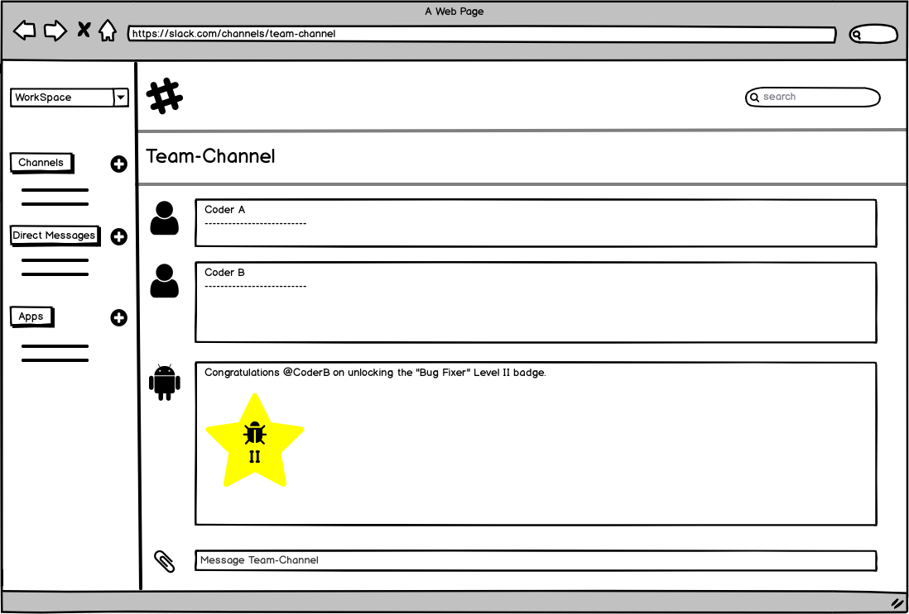
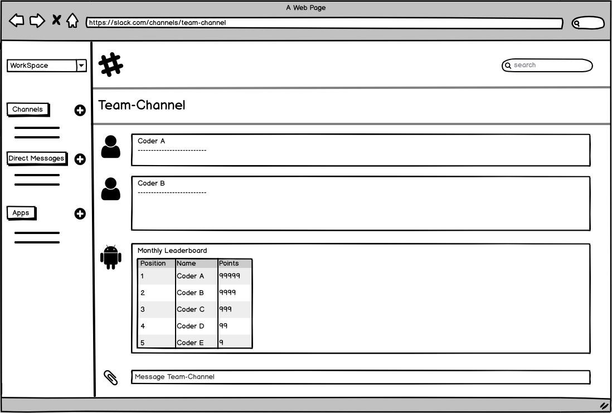
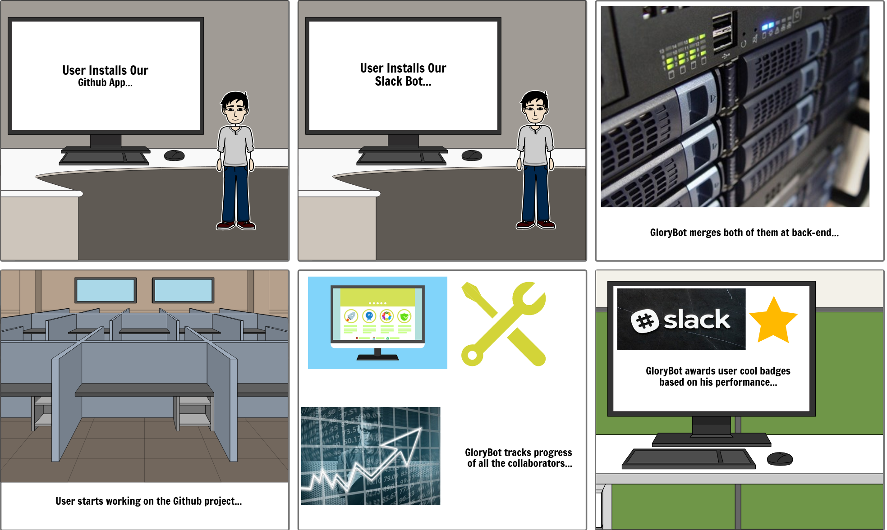
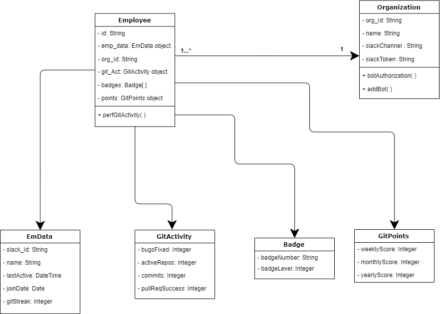
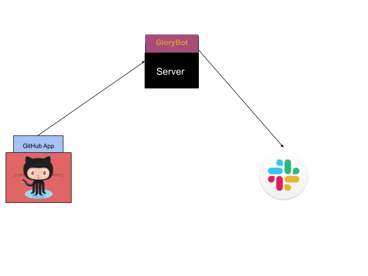

# GloryBot - A Reward Bot

## Problem Statement
 
In this project, we are addressing the issue of tracking an employee’s core competencies based on their contribution towards all the projects currently active in their organization. We assume that the organization uses GitHub to keep track of all the on-going projects. We wish to provide a way in which managers and higher authorities can keep a track of their employee’s and team’s progress, see who is most actively participating in each project, whose work is the most productive and also see how they are helpful and resourceful to the organization. This can be achieved by tracking their daily commits, milestones achieved, bugs fixed, etc. Although GitHub does keep track of all these activities, we would like to make use of all the tracked data and create a platform where the employee is awarded or recognized for the work they are doing. This forms the first goal of our Reward Bot - to build a peer-to-peer recognition platform, where the reward would be in the form of points and badges (aka titles) and also notifying peers of the employee achievements in the form of an up-to-date summary.
This issue is particularly an important one, especially in a professional setting, as it gives a better understanding of each employee’s day-to-day work and adds transparency and visibility into the whole recognition and rewarding process. It is also important to recognize each person’s contribution to boosting motivation and morale in the organization. An added functionality of maintaining a leaderboard will maintain a sense of healthy competition between peers. Our bot will also ensure that the rewards are instantly awarded and cut down on a lot of manual work of screening each employee’s contributions. At the end of the day, a healthy competition in the office environment is a win-win situation for the employees and the company.

## Bot Description

**GloryBot** is an employee recognition system that interacts with employees and teams through a corporate social network (slack) and helps in boosting morale and engagement amongst peers and promotes teamwork. Our bot tracks employee activities on GitHub recognizes certain actions performed by an employee and rewards them accordingly. For instance, it can determine the employee who contributed the most to a project from their actions like commit, merge, pull requests, etc on that project repository.

Our bot assigns badges like **“Bug Fixer”**, **“Top Contributor”** and **"The Unstoppable"** to employees of the team based on the actions they have performed on GitHub. GloryBot also maintains a leaderboard by awarding a certain number of points to each employee based on their actions. The weightage of points depends on the action performed (see Activity-Points table below) and at the end of every week, month and year, it announces the top 3 employees on Slack channels. GloryBot can also identify successful deployment actions (based on merge with production branch from stage or support branch being a successful deployment) by team and individuals and give them points accordingly. We have also added the functionality of congratulating every employee on their work anniversaries by summarizing their achievements up until that time and posting it on the company's common Slack channel. All the above awards will be communicated to all the employees via Slack channels. Most of the data required for this bot to work is will be fetched using GitHub's APIs. Other than that, we only need the Slack information of the organization. This will be asked for via the UI when the company adds our bot to their GitHub account. We plan to get individual employee information through the company's general channel and store their Slack IDs.

##### Data required by this bot from GitHub and Slack:
1. User data - A unique id or username of the employee, employee name, GitHub activities (commits, merge requests, successful merges, projects currently working and everything else available via GitHub repo Insights). The data from these activities are used to award points and maintain a leaderboard and also award badges based on certain rules that will be discussed next.

2. Organization Data - Name, Slack Channel ID (this data is also acquired by redirecting the user to their Slack account)

#### Rules for awarding badges:

1. **Bug Fixer** - This badge is dedicated to users that help solve ‘issues’ that are tagged as a ‘Bug’.
	* If the number of bugs fixed is greater than or equal to 10 and the number of repositories for which bugs were fixed is greater than 2, then such an employee will get the Bug Fixer - Level 1 badge.
	* Similarly, if the number of bugs fixed is greater than or equal to 10X and the number of repositories for which bugs were fixed is greater than 2X, then such an employee will get the Bug Fixer - Level X badge.

2. **Top Contributor** - This badge is given to the star performers of the repository. Calculated by the number of activities done in the repository.
	* This badge is awarded to the collaborater (employeee) who has number of contributions greater than a threshold amount. 
	* This badge also has different levels like the Bug Fixer badge.

3. **The Unstoppable** - This badge is inspired by the Snapchat streak feature and is given to a user who performs an activity everyday(not including weekends) for 100 days straight.

4. **The Commiter** - This badge is awarded to users who have performed commit points greater than or equal to 10 and they can level up for every 10 points they achieve.  
  
#### Activity - Points table:
| Activity      | Points        |
| ------------- |:-------------:| 
| Commit      | 3 |
| Pull request      | 3  |
| Successful Merge | 5 |

### Use Cases
~~~~
Use Case: Give recognition to the user via badges
1 Preconditions - User must have our GitHub app installed and allow our bot to be installed in their Slack channel
2 Main Flow - User will perform Github activities which will be tracked by our bot to check which type of badge should be awarded to the user.
3 Subflows - 
	[S1] The user will normally perform their tasks, while the app runs in the background and tracks all activities. 
	[S2] All activities will be converted to points and checked if the user has achieved a milestone, earning them a new “Badge”.
	[S3] If a user solves a number of bug issues above a particular threshold value, they are awarded the "Bug Fixer" badge. If a user performs a number of Github activities above a particular threshold value, they are awarded the "Top Contributor" badge. If a user performs a commit for 100 days straight, they are awarded  "The Unstoppable" badge. 
	[S3] This badge will be announced on the company slack channel privately as well as publicly.
4 Alternative flows -
	[A1] The user performs some activities like commits, merges, pull requests etc but the total number of these individual activities does not cross the threshold, then no badge is awarded to them. 
~~~~
~~~~
Use Case: Maintaining the Leaderboard
1 Preconditions - User must have our GitHub app installed and allow our bot to be installed in their Slack channel
2 Main Flow - The app will track all user actions to award "points" for each activity and create and maintain a leaderboard to keep healthy competition between colleagues
3 Subflows - 
	[S1] User performs any Github action and the bot calculates points for each activity and maintains a score for each user
	[S2] The scores allotted to each user will be maintained in a Leaderboard and compared with his/her colleagues.
	[S3] Upon comparison, leaderboards will be updated periodically (for e.g., once every month) and announced on Slack.
	[S4] The top 3 hard-working employees will be appreciated and they will be publicly recognized on the Slack channel of their company.
	[S5] The user can view the leaderboard by mentioning the bot alongwith the "leaderboard", i.e, type "@GloryBot leaderboard" on the Slack channel.
4 Alternative flows -
	[A1] The user is awarded points and accordingly moves up or down the leaderboard but they don’t make it to the top 3 hard-working employees. 
~~~~
~~~~
Use Case: Celebrating app’s anniversary at the company
1 Precons -  User must have our GitHub app installed and allow our bot to be installed in their Slack channel
2 Main Flow - Announce message on Slack channel to celebrate app's anniversary
3 Subflows -  
	[S1] At every 1st, 6th and 12th month completed at the company and every year after that, the bot will send out a message and announce how long the bot has been useful in recognizing each employee's work.
4 Alternative flow - 
	[A1] Bot hasn’t completed any of the above specified anniversary milestones and does not need to be celebrated.
~~~~

### Design Sketches

Following are the design sketches for our UI:

#### 1. Wireframes

* Visual mock-up of the Slack channel when a badge is awarded to an employee
		

* Visual mock-up of the Leaderboard being announced on Slack
		

#### 2. Storyboard

#### 3. Class Diagram of our core data

 

## Architecture Design

GloryBot will essentially be a GitHub app which can be installed by a user/organization in their GitHub user account. Upon successful installation, our bot will redirect them to the Slack Log In page in order to get authorization for posting on their channel. Once the organization's Slack details are fetched, our bot will have everything it needs to start working full-fledgedly. It'll now actively listen to GitHub events and will initiate the rewarding process as explained earlier based on certain steps and rules associated with events. The reward messages and updates will be communicated to employees and teams via the registered Slack channel. Hence, the bot acts as a communication medium between these two platforms.

#### Guidelines and constraints:

1. The bot (Github App) must be installed and have access to the organization's repositories.
2. The bot must be a part of the organization's corporate communication channel (Slack).
3. The bot must be given permission to save some data about repositories and employees like (Employee name, Repo name, Commits, Issues, etc) to function properly.

###  High-level Component Design
		

## Additional Patterns

Following is the Data Model that shows how the data will be stored: 

1. Data Model for a user
~~~~
User: { 
	id: String,
   	info: { 
      		name: String,
      		lastActive: DateTime,
      		joinDate: Date,
      		gitsStreak: Number
   	}   
	
	org_id: String,
   	git_Act: { 
      		   bugsFixed: Number,
      	 	   activeRepos: Number,
      		   commits: Number,
      		   pullReqSucess: Number
   	}   
	
	badges: Badge[],
   	points: { 
      		   weeklyScore: Number,
      		   monthlyScore: Number,
      		   yearlyScore: Number
   	}
}
~~~~

2. Data Model for storing badge information
~~~~
Badge: { 
   	  badgeNumber: String,
   	  badgeLevel: Number,
}
~~~~

3. Data Model to store information rergarding the organization
~~~~
Organization: { 
		 ord_id:string,
		 name: String,
		 slackChannel: String,
		 slackToken: String
}
~~~~

