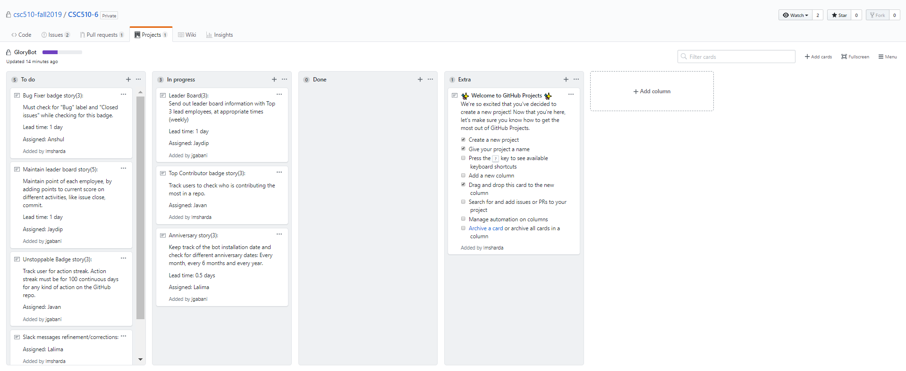

## Process
In this milestone, we worked on implementing and refining all our reward bot's use cases and the main features that process these use cases. We started with a planning meeting and divided the work and assigned tasks amongst ourselves. The plan was set to achieve these goals in two iterations or sprints each having a duration of one week. The details of each iteration is discussed below.

### Iteration 1
At the beginning of the first iteration we created a Kanban board under GitHub Projects, where we created stories babed on our tasks. The Kanban board consisted of 3 columns - a To Do List, an In Progress List and a Done List. We kept updating the board as and when we completed the stories. Most of the implementation was completed in the first iteration. This included implementing our refined use cases, testing the features against a few plausible cases, and improving our output messages. We also tested our code continuously at various check points during implementation to avoid writing buggy code.  

The Kanban board before the first iteration started looked like below:

### Iteration 2
In the second iteration we compiled all the code, refactored it and tested it against multiple test cases. We also had to do some debugging in order to accomodate for alternative flows. We also made some changes in how our rewards output was displayed on the Slack channel. Once we were satisfied with the implementation, we deployed the code on AWS.

The Kanban Board for the second iteration looks as follows:

## Practices
We implemented Pair Programming in our team as the core practice and alternated our roles as Driver and Navigator in pairs of two. For our corollary practices, we implemented Incremental Deployement and Team Continuity.

### Core: Pair Programming

#### Team 1:-
User stories implemented:
1. Bug Fixer Badge (Driver: Anshul, Navigator: Lalima)

    Whenever an issue which has "bug" label is closed, we give points to the user for closing an issue and check whether the user is elligible for next level Bug Fixer Badge.

2. Anniversary (Driver: Lalima, Navigator: Anshul)

    We celebrate weekly, monthly and yearly annviersary of our bot installation and all those user who join channel after installation of our bot.

#### Team 2:-
User stories implemented:
1. Leaderboard (Driver: Jaydip, Navigator: Javan)

    Whenever a user performs an activity like opening/closing an issue, commit, pull request, merge, etc., we increment points corresponding to that user and update the leaderboard.

    Whenever someone directly mentions our bot on slack channel with the message "leaderboard", our bot replies with the latest leaderboard.

2. Contributor Badge (Driver: Javan, Navigator: Jaydip)

    Whenever a user performs an activity like opening/closing an issue, commit, pull request, merge, etc., they are awarded points and whenever a user reaches 10 points, they are awarded the Contributor Level 1 badge. The badge level increases after every 10 point increase.

3. Unstoppable Badge (Driver: Javan, Navigator: Jaydip)

    Whenever a user completes working for 100 consecutive days, we award them the Unstoppable Badge and for every 100th consecutive work day after that, we award them the Unstoppable Badge of higher levels. If the user fails to do any activity we reset the user's counter.

Overall, we found that Pair Programming improved our code quality and increased our development speed. Pair rotation enhanced our learning experience as well.

### Corollary Practices

#### 1. Incremental Deployment:
As mentioned in Pair Programming, we had divided up the functionalities into teams of two and each functionality was implemented one at a time. As and when a functionality was completely implemented, it was first tested thoroughly with the existing code and then pushed into the main codebase for deployment. Only then did the team move on to the next functionality.  

#### 2. Team Continuity:
We believed that we could achieve our goals faster and more efficiently if we worked as a team. We worked in teams of two which were created based each of our experiences in software development. Then we assigned tasks amongst ourselves and worked together to achieve them. Working in teams of two was helpful as we could constantly keep cross-checking each other's code for correct implementation and discuss and overcome potential problems within the software much more efficiently as compared to dealing with them alone.
